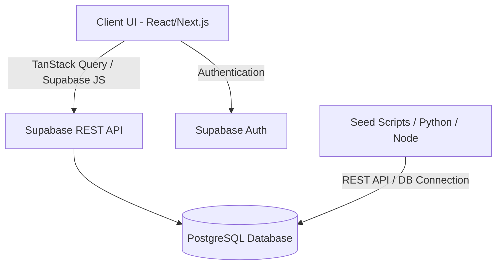

# Tài liệu Đặc tả Hệ thống & Kiến trúc - GxP Portal

Tài liệu này đóng gói toàn bộ thông tin chi tiết về kiến trúc, cơ sở dữ liệu, logic nghiệp vụ của các module, quy tắc ánh xạ (mapping) và các quy chuẩn UI/UX của dự án **GxP Portal** để hỗ trợ bạn phát triển tiếp dự án trên AG IDE.

---

## 1. Tổng quan & Kiến trúc Hệ thống

**GxP Portal** là một ứng dụng web nội bộ được thiết kế cho các bộ phận **QA (Đảm bảo chất lượng)**, **KHO (Kho vận)**, **SCM (Chuỗi cung ứng)**, và **CS (Dịch vụ khách hàng)** để kiểm soát quy trình chất lượng dược phẩm/thiết bị y tế theo tiêu chuẩn GxP.



### Công nghệ sử dụng:
*   **Frontend**: Next.js (App Router), React, TailwindCSS, Lucide-React (Icons).
*   **UI Component Library**: Ant Design (Antd).
*   **Database & Backend**: Supabase (PostgreSQL), Supabase Auth.
*   **State Management & Data Fetching**: `@tanstack/react-query` để đồng bộ dữ liệu và lưu cache.
*   **Form & Validation**: `react-hook-form` + `zod` + `@hookform/resolvers/zod` để validate chặt chẽ dữ liệu đầu vào.
*   **Tiện ích**: `dayjs` (Ngày tháng), `xlsx` (Xử lý Excel), `recharts` (Biểu đồ).

---

## 2. Cấu trúc Database (Supabase Schema Mapping)

Hệ thống bao gồm 14 bảng quan hệ chính được thiết lập trong schema `public`:

### 2.1 Bảng Danh mục & Cấu hình Gốc

#### `users` (Thông tin nhân viên & Phòng ban)
Lưu trữ thông tin người dùng được ánh xạ từ hệ thống Auth để phục vụ phân quyền (RBAC).
*   `id` (UUID - Khóa chính): Tham chiếu tới Auth User.
*   `email` (TEXT - Unique, Not Null)
*   `full_name` (TEXT - Not Null)
*   `department_code` (TEXT - Not Null): `QA`, `KHO`, `SCM`, `CS`, hoặc `DEV`.
*   `system_role` (TEXT - Not Null): `admin` hoặc `staff`.

#### `portal_apps` (Cấu hình danh sách ứng dụng động)
Dùng để render Dashboard tùy biến động theo phòng ban.
*   `app_id` (UUID - Khóa chính): Tự động tạo.
*   `app_name` (TEXT - Not Null): Tên hiển thị công cụ.
*   `type` (TEXT - Not Null): `link` (mở trang con) hoặc `folder` (mở thư mục chứa app con).
*   `target_url` (TEXT - Nullable): Đường dẫn route (ví dụ: `/apps/cc`).
*   `parent_id` (UUID - Nullable): Trỏ về `app_id` của thư mục cha.
*   `allowed_depts` (TEXT[] - Not Null): Mảng phòng ban có quyền truy cập (ví dụ: `{"QA", "KHO"}`).
*   `is_testing` (BOOLEAN - Default: false): Nếu `true`, hiển thị ruy-băng "TESTING MODE".
*   `order_index` (INT - Default: 0): Thứ tự hiển thị.

#### `master_suppliers` (Danh mục Nhà Cung Cấp - NCC)
*   `supplier_code` (TEXT - Khóa chính): ID NCC viết hoa (ví dụ: `ABBOTT`, `SANOFI`).
*   `supplier_name` (TEXT - Not Null): Tên đầy đủ hiển thị.
*   `notes` (TEXT - Nullable): Ghi chú NCC.
*   `business_type` (TEXT[] - Default: `{}`): Loại hình của NCC (chọn nhiều: `Nhập Khẩu`, `Trong nước`, `Tự doanh`).

#### `master_items` (Danh mục Sản phẩm INFOR/SAP)
*   `item_code` (TEXT - Khóa chính): Mã sản phẩm (ví dụ: `SA1100013`).
*   `item_name` (TEXT - Not Null): Tên sản phẩm + Hàm lượng + Quy cách.
*   `supplier_code` (TEXT - FK): Khóa ngoại tham chiếu `master_suppliers(supplier_code) ON DELETE SET NULL ON UPDATE CASCADE`.
*   `visa_no` (TEXT - Nullable): Số đăng ký lưu hành.
*   `is_active` (BOOLEAN - Default: true): Trạng thái kinh doanh.
*   `gross_weight` / `net_weight` / `cube` / `tare_weight` (NUMERIC)
*   `pallet_qty` / `case_qty` / `inner_pack` (NUMERIC)

#### `product_label_mappings` (Liên kết Mã sản phẩm - Nhãn phụ)
*   `id` (BIGINT - Identity, Khóa chính)
*   `product_item_code` (TEXT - FK): Tham chiếu `master_items(item_code) ON DELETE CASCADE`.
*   `label_item_code` (TEXT - FK): Tham chiếu `master_items(item_code) ON DELETE CASCADE`.
*   `quantity_per_unit` (NUMERIC - Default: 1)
*   *Ràng buộc*: `UNIQUE (product_item_code, label_item_code)`.

---

### 2.2 Các Module nghiệp vụ (Tracking Modules)

> [!NOTE]
> Để đáp ứng yêu cầu nghiệp vụ thực tế (một mã theo dõi có thể tương ứng với nhiều dòng hàng, nhiều số lô), tất cả các khóa chính cũ của các bảng nghiệp vụ (như `awc_code`, `bbsc_code`, `cc_code`, `int_code`) đã được thay thế bằng khóa chính tự tăng `id` độc lập (Identity Key). Khóa UNIQUE trên các cột mã theo dõi đã được gỡ bỏ để cho phép nhập trùng mã theo dõi cho các dòng hàng khác nhau.

#### 1. Module IMP (Nhập khẩu)
Theo dõi hành trình lô hàng nhập khẩu từ khi về cảng đến khi thông quan.
*   **Bảng `imp_shipments`**:
    *   `invoice_number` (TEXT - Khóa chính): Số hóa đơn của lô hàng.
    *   `supplier_code` (TEXT - Not Null): Mã nhà cung cấp.
    *   `coa_status` (TEXT): `Đầy đủ`, `Chưa có`.
    *   `label_status` (TEXT): `Đã dán`, `Chưa dán`, `Chưa có`.
    *   `progress_status` (TEXT): Trạng thái tiến độ (`Created`, `In Transit`, `Customs Clearance`, `At Port`, `Completed`).
    *   `has_data_logger` (BOOLEAN): Có máy đo nhiệt độ không.
    *   `temp_out_of_range` (BOOLEAN): Nhiệt độ ngoài giới hạn.
    *   `import_date_lh` / `import_date_hn` (DATE): Ngày nhập cảng (Lạch Huyện / Hà Nội).
*   **Bảng `imp_shipment_items`**:
    *   `id` (BIGINT - Identity, Khóa chính)
    *   `invoice_number` (TEXT - FK): Tham chiếu `imp_shipments(invoice_number) ON DELETE CASCADE`.
    *   `item_code` (TEXT): Mã sản phẩm.
    *   `item_name` (TEXT - Not Null)
    *   `required_labels` (JSONB): Chi tiết các nhãn phụ cần dán.

#### 2. Module AWC (Thay đổi AW)
*   **Bảng `awc_changes`**:
    *   `id` (BIGINT - Identity, Khóa chính)
    *   `awc_code` (TEXT - Not Null): Mã phiếu (ví dụ: `AWC-001-24`).
    *   `notice_date` (DATE - Not Null): Ngày nhận thông báo.
    *   `item_code` (TEXT - FK): Tham chiếu `master_items(item_code)`.
    *   `supplier_code` (TEXT - FK): Tham chiếu `master_suppliers(supplier_code) ON UPDATE CASCADE`.
    *   `new_item_code` (TEXT - FK): Mã sản phẩm mới (nếu thay thế).
    *   `status` (TEXT - Default: `'Alerted'`): Trạng thái (`Alerted`, `Pending 1st Batch`, `Verified`, `Closed`).
    *   `old_info` / `new_change_info` (TEXT)
    *   `expected_batch` / `actual_batch` (TEXT)
    *   `estimated_receive` / `actual_receive` (DATE)
    *   `evidence_url` (TEXT): Link ảnh/tài liệu minh chứng.
    *   `impact_analysis` (JSONB): Đánh giá tác động chất lượng.

#### 3. Module LBL (Nhãn phụ)
*   **Bảng `lbl_labels`**:
    *   `id` (BIGINT - Identity, Khóa chính)
    *   `item_code` (TEXT - FK): Tham chiếu `master_items(item_code) ON DELETE CASCADE`.
    *   `product_category` (TEXT - Not Null): `Thuốc`, `TPCN`, `TTBYT`, hoặc `Mỹ phẩm`.
    *   `supplier_code` (TEXT - FK): Tham chiếu `master_suppliers(supplier_code) ON UPDATE CASCADE`.
    *   `base_label_code` (TEXT - Not Null): Số mã hóa gốc của nhãn.
    *   `version_number` (TEXT - Not Null): `Ver01`, `Ver02`,...
    *   `status` (TEXT - Default: `'Draft'`): `Draft`, `Active`, hoặc `Obsolete`.
    *   `effective_date` (DATE - Not Null): Ngày bắt đầu có hiệu lực.
    *   `original_file_url` (TEXT): Link PDF file nhãn thiết kế.
    *   `preview_image_url` (TEXT): Ảnh xem trước nhãn.
    *   *Ràng buộc*: `UNIQUE (item_code, version_number)`.

#### 4. Module LDG (Lệnh ĐG)
*   **Bảng `ldg_orders`**:
    *   `ldg_code` (TEXT - Khóa chính): Mã lệnh đóng gói (ví dụ: `LDG-0770-0423`).
    *   `item_code` (TEXT - FK): Tham chiếu `master_items(item_code)`.
    *   `supplier_code` (TEXT - FK): Tham chiếu `master_suppliers(supplier_code) ON UPDATE CASCADE`.
    *   `lot_number` (TEXT - Not Null)
    *   `exp_date` (DATE - Not Null)
    *   `batch_size` (NUMERIC - Not Null): Số lượng sản xuất.
    *   `label_version_id` (BIGINT - FK): Phiên bản nhãn sử dụng, tham chiếu `lbl_labels(id)`.
    *   `six_sides_photo` (TEXT): Đường dẫn ảnh chụp 6 mặt kiện mẫu.
    *   `status` (TEXT - Default: `'Draft'`): `Draft`, `In Progress`, `Pending QA Review`, `Issue`, `Released`.
*   **Bảng `ldg_lpns`** (License Plate Numbers - Các kiện đóng gói):
    *   `id` (BIGINT - Identity, Khóa chính)
    *   `ldg_code` (TEXT - FK): Tham chiếu `ldg_orders(ldg_code) ON DELETE CASCADE`.
    *   `lpn_code` (TEXT - Not Null): Mã số LPN kiện hàng.
    *   `quantity` (NUMERIC - Not Null): Số lượng hàng trong kiện.
    *   `released_qty` (NUMERIC): Số lượng đã được QA xuất kho.
    *   `incident_note` (TEXT): Ghi nhận sự cố khi đóng gói nếu có.

#### 5. Module INC (BBSC)
*   **Bảng `bbsc_incidents`**:
    *   `id` (BIGINT - Identity, Khóa chính)
    *   `bbsc_code` (TEXT - Not Null): Mã sự cố (ví dụ: `BBSC-0001-0124`).
    *   `status` (TEXT - Default: `'Khởi tạo'`): `Khởi tạo`, `Chờ hết INV`, `Hoàn tất`, `Đóng`.
    *   `supplier_code` (TEXT - FK): Tham chiếu `master_suppliers(supplier_code) ON UPDATE CASCADE`.
    *   `department_id` (TEXT - Not Null): Phòng ban xảy ra sự cố (ví dụ: `Kho Nhập`, `ĐGC2`).
    *   `pic_id` (UUID - FK): Người chịu trách nhiệm chính, tham chiếu `users(id)`.
    *   `sub_pic_id` (UUID - FK): Người hỗ trợ xử lý.
    *   `item_code` (TEXT - FK): Tham chiếu `master_items(item_code)`.
    *   `lot_number` (TEXT - Not Null)
    *   `exp_date` (DATE - Not Null)
    *   `quantity` (NUMERIC - Not Null)
    *   `lpn_code` (TEXT)
    *   `defect_description` (TEXT - Not Null): Mô tả chi tiết lỗi phát sinh.
    *   `custom_fields` (JSONB): Các trường thông tin bổ sung tùy chọn.
    *   `resolution_action` (TEXT): Phương án khắc phục.

#### 6. Module COMP (Khiếu nại)
*   **Bảng `cc_complaints`**:
    *   `id` (BIGINT - Identity, Khóa chính)
    *   `cc_code` (TEXT - Not Null): Mã khiếu nại (ví dụ: `CC_010125-HCM`).
    *   `complaint_date` (DATE - Not Null)
    *   `customer_name` (TEXT - Not Null)
    *   `customer_address` (TEXT)
    *   `item_code` (TEXT - FK): Tham chiếu `master_items(item_code)`.
    *   `supplier_code` (TEXT - FK): Tham chiếu `master_suppliers(supplier_code) ON UPDATE CASCADE`.
    *   `lot_number` (TEXT - Not Null)
    *   `exp_date` (DATE - Not Null)
    *   `quantity` (NUMERIC - Not Null)
    *   `complaint_reason` (TEXT - Not Null): Lý do khiếu nại của khách hàng.
    *   `root_cause` (TEXT): Nguyên nhân gốc sau khi QA thẩm tra.
    *   `status` (TEXT - Default: `'Khởi tạo'`): `Khởi tạo`, `Chờ Hãng xác nhận`, `Đang xử lý`, `Hoàn tất`, `Hủy khiếu nại`.
    *   `is_info_secured` (BOOLEAN - Default: false): Bảo mật thông tin khách hàng.
    *   `supplier_action` (TEXT): Phương án phản hồi từ Hãng.

#### 7. Module INT (Nội bộ)
*   **Bảng `int_records`**:
    *   `id` (BIGINT - Identity, Khóa chính)
    *   `int_code` (TEXT - Not Null): Số biên bản (ví dụ: `INT-0001-24`).
    *   `category` (TEXT - Not Null): `PAP`, `Chuyển kho`, `Nội bộ kho xử lý`, `Yêu cầu hãng`,...
    *   `item_code` (TEXT - FK): Tham chiếu `master_items(item_code)`.
    *   `supplier_code` (TEXT - FK): Tham chiếu `master_suppliers(supplier_code) ON UPDATE CASCADE`.
    *   `lot_number` (TEXT - Not Null)
    *   `exp_date` (DATE - Not Null)
    *   `lpn_code` (TEXT - Not Null)
    *   `quantity` (NUMERIC - Not Null)
    *   `incident_content` (TEXT - Not Null): Nội dung biên bản lỗi phát hiện nội bộ.
    *   `handling_status` (TEXT - Default: `'Chờ xác định'`): `Chờ xác định`, `Chuyển bán`, `Chuyển hủy`, `Xuất trả`.
    *   `wms_doc_number` (TEXT): Số chứng từ tương ứng trên WMS.

---

## 3. Logic Nghiệp vụ Lõi & Phân Quyền (RBAC)

Hệ thống triển khai phân quyền trên giao diện dựa vào thông tin bộ phận (`department_code`) và vai trò (`system_role`) của người dùng đăng nhập hiện tại:

```
                  ┌─────────────────────────────────────┐
                  │          Người Dùng Đăng Nhập       │
                  └──────────────────┬──────────────────┘
                                     │
                     [system_role === 'admin'?]
                                    / \
                                  Có   Không
                                 /       \
               ┌────────────────┐         ┌───────────────────────────────┐
               │ Xem toàn bộ    │         │ Lọc App động:                 │
               │ ứng dụng &     │         │ allowed_depts chứa            │
               │ Danh mục gốc   │         │ user.department_code          │
               └────────────────┘         └───────────────────────────────┘
```

1.  **Dashboard Lưới Ứng Dụng (App Dashboard)**:
    *   Dữ liệu được lấy động từ bảng `portal_apps`.
    *   Ứng dụng chỉ được hiển thị nếu mã phòng ban (`department_code`) của người dùng hiện tại nằm trong mảng `allowed_depts` của ứng dụng đó.
    *   Tài khoản có vai trò `admin` mặc định sẽ hiển thị toàn bộ tất cả ứng dụng mà không cần lọc theo phòng ban.
2.  **Ruy-băng Thử Nghiệm (Testing Ribbon)**:
    *   Mỗi ứng dụng có cờ `is_testing` bằng `true` sẽ được bo góc hiển thị dải ruy-băng chéo màu đỏ ghi chữ **TESTING MODE** để báo hiệu tính năng đang thử nghiệm thử nghiệm.
3.  **Trang Quản lý Danh Mục Gốc (Admin Panels)**:
    *   Các tab/trang quản trị `/admin/master-items` (Danh mục SP), `/admin/master-suppliers` (Danh mục NCC), và trang liên kết SP - Tem chỉ cho phép tài khoản có `system_role === 'admin'` truy cập. Nếu tài khoản staff cố tình truy cập trực tiếp bằng đường dẫn URL, giao diện sẽ kích hoạt màn hình chặn truy cập cảnh báo lỗi bảo mật.

---

## 4. Quy tắc Nhập liệu & Dữ liệu mẫu (Ingestion & Seed Logic)

### 4.1. Quy tắc Seed Data mới (`seed_new_modules.js`)
Khi chạy script `node scripts/seed_new_modules.js` để nạp dữ liệu từ các file Excel kiểm thử:
*   **Quy tắc 3 bản ghi mới nhất**: Nhóm dữ liệu theo mã phiếu theo dõi (`awc_code`, `bbsc_code`,...) và ngày tạo của phiếu. Sắp xếp giảm dần theo ngày và chỉ lưu trữ lại đúng 3 nhóm phiếu mới nhất của mỗi Module. Các phiếu cũ hơn sẽ tự động bị xóa bỏ để giữ cơ sở dữ liệu demo sạch sẽ và tập trung.
*   **Ánh xạ Nhà Cung Cấp**: Khi nạp mặt hàng mới, nếu gặp mã NCC chưa tồn tại trong bảng `master_suppliers`, hệ thống tự động chèn thêm NCC đó vào bảng danh mục gốc với tên mặc định bằng chính mã NCC để tránh lỗi ràng buộc khóa ngoại (Foreign Key Violation).

---

## 5. Tiêu chuẩn và Thiết kế UI/UX

Toàn bộ ứng dụng GxP Portal tuân thủ nghiêm ngặt tiêu chuẩn thiết kế cao cấp, đồng bộ và nhất quán:

*   **Tông màu chủ đạo**: Màu xanh mòng két (Teal - mã `#0d9488`) tạo cảm giác chuyên nghiệp, đáng tin cậy của ngành Y tế và Đảm bảo chất lượng.
*   **Tính năng Co giãn Cột (Resizable Columns)**: Tất cả bảng dữ liệu sử dụng thẻ tiêu đề `ResizableTitle` của Ant Design, cho phép người dùng dùng chuột kéo giãn chiều rộng từng cột trực quan. Trạng thái độ rộng và thứ tự cột được lưu trữ lại theo tài khoản người dùng thông qua custom hook `useTablePreferences` để khôi phục cấu hình ở lần truy cập sau.
*   **Giới hạn số lượng ký tự**: Tất cả các ô dữ liệu dạng văn bản hiển thị trên danh sách bảng giới hạn hiển thị tối đa **50 ký tự**. Nếu vượt quá 50 ký tự, chuỗi sẽ tự động bị cắt gọn và thêm dấu ba chấm `...` đồng thời hiển thị đầy đủ văn bản thông qua thẻ gợi ý gợi ý (`Tooltip`) của Ant Design khi di chuột vào ô đó.
*   **Bộ lọc Header (Column Filter)**: Tích hợp trực tiếp ô tìm kiếm thông minh dạng Wildcard/Regex ngay dưới tiêu đề mỗi cột để lọc nhanh dữ liệu mà không cần tải lại trang.
